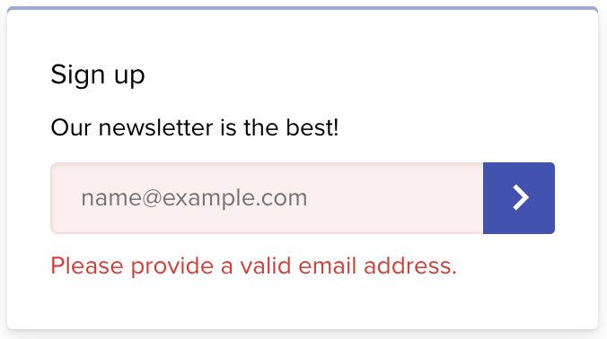
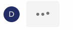
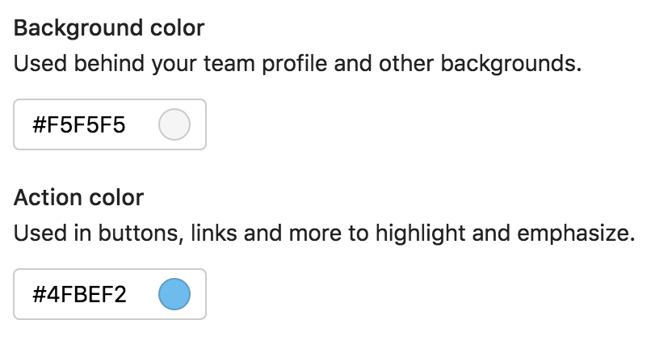
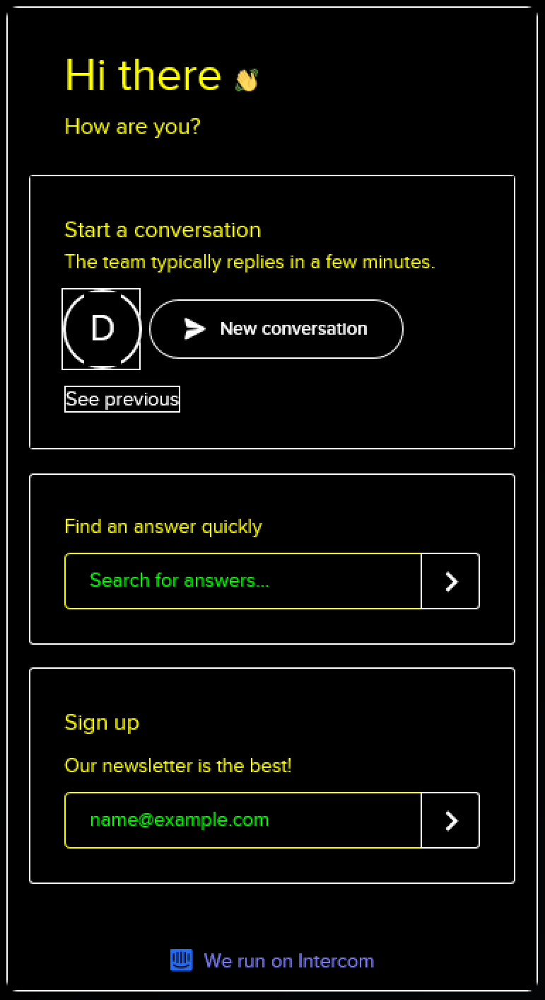

import Iframe from "$components/iframe";
import Image from "$components/image";

_[This is a cross post from the Intercom blog.](https://www.intercom.com/blog/messenger-accessibility/)_

## Here at Intercom, our mission is to make internet business personal. But in order for an internet business to be personal, it must also be possible for everyone to access.

More than one billion people worldwide live with a disability – that’s more than [15% of the global population](https://www.audioeye.com/resources/accessibility-essentials/). Without assistive technologies like screen readers, the web is inaccessible or hard for them to use. Think of it this way: it’s like entering your neighborhood coffee shop and if you’re in a wheelchair, discovering that the counter is too tall for you to reach.

We believe businesses should be able to communicate with everyone on their website, regardless of how their visitors interact with the web. This isn’t just a company philosophy; it’s also an engineering commitment. To prioritize accessibility in [our Messenger](https://www.intercom.com/messenger), we took a hard look at the technical improvements we needed to make and turned what were often fuzzy requirements into real, meaningful solutions.

What we achieved is making our web Messenger accessible and compliant with the [Web Content Accessibility Guidelines 2.0 Level AA](https://www.w3.org/TR/UNDERSTANDING-WCAG20/conformance.html#uc-conformance-requirements-head).

## A shared framework for web accessibility

[The Web Content Accessibility Guidelines (WCAG)](https://www.w3.org/WAI/standards-guidelines/wcag/) are a shared set of technical standards that explain how to make web content accessible to people with disabilities. Its 12 guidelines are organized around four main principles, which provide the foundation for web accessibility:

- **Perceivable**: Users must be able to perceive the content in some way, using one or more of their senses. For instance, images that convey meaningful information should have alternative text provided.
- **Operable**: Users must be able to control UI elements. For example, all functionality like buttons and form elements should be accessible using keyboard controls.
- **Understandable**: The content must be understandable to its users. That means things like the language of the page should be detectable in the code.
- **Robust**: The content must be developed using well-known and adopted web standards. In other words, your code should be easily parsed and interpreted by different browsers and user agents like screen readers.

Our engineering work started by exploring the WCAG guidelines and then identifying all the areas in our web Messenger that needed improvement. As we quickly learned, turning these four principles into real solutions was simpler on paper than in practice.

## Turning fuzzy requirements into real solutions

The WCAG guidelines are extensive – across the four principles, there are nearly 100 sections – and some areas are quite fuzzy. Requirements like “meaningful sequence” and “focus order” are very broad in scope, especially for applications like ours that get embedded in many different environments.

These fuzzy requirements meant there wasn’t always a direct or obvious correlation between the WCAG guidelines and what we needed to build. We encountered issues that didn’t have clear answers online, leaving it up to us to come up with the right technical solutions.

In the end, we identified three main areas of focus for accessibility in our web Messenger:

- Keyboard navigation
- Screen reader support
- Color contrast

I’ll walk you through each of these areas, what we learned and the solutions we shipped.

## Improving keyboard navigation

Keyboard navigation is a very important part of making your app accessible. When visually or auditory impaired people use web browsers, they often rely on keyboard navigation to tab into fields and then have their screen reader read what action could be performed.

Our work on keyboard navigation can be broken down into three main changes:

1.  Making elements clickable by keyboard
2.  Setting proper focus states
3.  Designing intentional focus traps

### 1. Making elements clickable by keyboard

The Intercom web Messenger is a [React](https://reactjs.org/) app. If we want keyboard navigation to work with the Messenger, every onClick handler that is added to an element, except the [elements that browsers support natively](http://websiteaccessibility.donaldevans.com/2011/06/30/when-does-onclick-work-with-the-keyboard-enter-key), also needs onKeyDown that checks if the enter or space keys were pressed and execute the same function as the onClick handler.

Let’s imagine a scenario where our component looks like this (These examples include React components using JSX. [You can learn more about JSX here](https://reactjs.org/docs/introducing-jsx.html).):

```jsx
export default (props) => (
  <div onClick={props.onClick}>Open modal</div>;
);
```

In order to make this component keyboard accessible, we can convert it to a button:

```jsx
export default (props) => (
  <button onClick={props.onClick}>Open modal</button>;
);
```

This might not always be easy because your component might be quite complex – for instance, you probably don’t want to wrap your whole app in a `<button>` element – and buttons have specific styling.

Another approach to make this component accessible is to add `onKeyDown`, `tabIndex` and `role` attributes to it:

```jsx
export default (props) => (
  <div
    onClick={props.onClick}
    onKeyDown={(e) => (e.keyCode === 13 || e.keyCode === 32) && props.onClick(e)}
    tabIndex="0"
    role="button"
  >
    Open modal
  </div>;
);
```

The problem is that adding these three attributes to every clickable element in your app is quite a lot of work, and it’s easy for engineers adding new functionality to forget to add these attributes or use the `<button>` element instead.

#### Building an automated solution

To make keyboard accessibility the default condition, we wrote a custom babel plugin that automatically adds `onKeyDown`, `tabIndex` and `role` attributes to all elements where:

1.  Browsers do not natively support tabNavigation.
2.  Browsers do not natively trigger `onClick` handlers when a user hits the enter or space keys.

Since babel transforms JSX into regular JavaScript function calls, it’s easy to statically determine components that need to have keyboard events added to them. Our custom babel plugin now handles the majority of our keyboard navigation issues.

Here’s an example of using [babel-plugin-react-add-a11y-props](https://github.com/danielhusar/babel-plugin-react-add-a11y-props) within a React app:

<Iframe src="https://codesandbox.io/embed/0426x9l46n?expanddevtools=1&view=preview" width={920} height={300} />

For the folks wondering about the performance implications of having an arrow function in the render method, it [really is fine](https://cdb.reacttraining.com/react-inline-functions-and-performance-bdff784f5578), but since your mileage may vary, you should always measure your performance before you optimize.

While this plugin will add keyboard navigation to all elements with onClick, if something behaves like a button, the [best solution](https://twitter.com/ryanflorence/status/1061440057213575168) is still to change it to an actual button element.

### 2. Setting proper focus states

In order for your app to be navigable by keyboard, you need proper focus states. Focus states help users and their screen readers understand where they are in the app and what elements are being selected.

A good rule of thumb is, if a user is relying on keyboard navigation, there should be a visual indicator to highlight which element currently has focus. In our case, we’ve designed our visual indicators to show only if we detect you are using keyboard navigation. That way, we minimize visual noise for our mouse users. You can use [focus-visible](https://developer.mozilla.org/en-US/docs/Web/CSS/:focus-visible) to provide a different focus indicator based on the user’s input modality, keyboard or mouse.

### 3. Designing intentional focus traps

For keyboard navigation to work, you may need to set intentional focus traps. Focus traps refer to times when a user hits the tab key or shift + tab keys, and they’re placed in a [certain cycle of focusable elements](https://www.w3.org/TR/wai-aria-practices-1.1/#dialog_modal). The most common example where you would want to set up a focus trap is a modal.

In our case, while the Messenger is open, we’ve set a focus trap so users are not able to tab outside of it. That way, users are able to navigate all of the elements in the Messenger without having to navigate through the entire webpage. Here is our Messenger’s focus trap in action:

<Image width={396}>


</Image>

Setting a focus trap is usually a complex task. Focus from last element should jump to the first one and when going backwards, the focus should jump from the first one to the last one. For that to work, you need to calculate all the focusable elements, set up proper event listeners and have it flexible enough that you can override those rules.

We have created an [open-source library](https://github.com/danielhusar/focus-trap) to quickly and easily create focus traps. This library provides a high-level API that will handle the focus traps. A simple example is to pass the dom element in which the focus should be trapped:

```js
const trap = new FocusTrap({
  node: document,
})
```

You can check out the focus traps in action here:

<Iframe src="https://codesandbox.io/embed/4rn8vm4nv0?expanddevtools=1&view=preview" width={920} height={600} />

Just as it’s important to set intentional focus traps, you should always provide a way for keyboard users to exit those focus traps. You can see that in the example below. We’ve also designed it so that after the modal is closed, the focus returns back to the element that originally opened the modal. Here it is in our Messenger:

<Image width={700}>


</Image>

## Supporting screen readers

Screen readers are software applications that allow visually impaired users to read text that is displayed on their computers. Together with keyboard navigation, providing full support to screen readers was crucial to making our Messenger accessible.

Our work on supporting screen readers can be broken down into four main changes:

1.  Making text content readable and navigable
2.  Defining states and properties with ARIA attributes
3.  Adding visually hidden text
4.  Removing mouse hover states

### 1. Making text content readable and navigable

The first thing we did was set the language attribute on HTML elements. Screen readers use this attribute to determine the language of the page and read the text in its intended way.

The second thing we did was add semantic markup to our Messenger. Since our Messenger is a single page app that you embed, SEO doesn’t apply to it and semantic markup hadn’t been a priority. To support screen readers, we updated our code to include semantic elements like headings, paragraphs and labels.

2. Defining states and properties with ARIA attributes

To fully support screen readers in our web Messenger, we used WAI-ARIA attributes. [Accessible Rich Internet Applications (ARIA)](https://developer.mozilla.org/en-US/docs/Web/Accessibility/ARIA) are a set of attributes that supplement HTML so screen readers can handle common interactions like forms hints and error messages, live content updates and more.

#### Establishing non-text elements with aria-label

We have added the `aria-label` attribute to all elements that have onClick handler but it’s not clear to screen readers what the intended functionality is. The most common scenario is when elements have decoration styles without any text. The screen reader will read the aria-label when keyboard is focused on that element. The “close” button is good example:

<Image width={376}>


</Image>

We also support an [ecosystem of apps](https://www.intercom.com/app-store/) that are built on top of our Messenger. Previously it was was not possible to make Messenger apps accessible. Now we have extended our framework with `aria-label` attributes so every Messenger app can be fully accessible. For instance, the [Article Search](https://www.intercom.com/app-store/?app_package_code=article-search&search=article) app is accessible with `aria-label` attributes for the input field and submit button:

<Image width={343}>


</Image>

#### Announcing dynamic changes with aria-live

Our Messenger behaves like a single page app. To support dynamic changes to our content without page reload, we added [aria-live attributes](https://developer.mozilla.org/en-US/docs/Web/Accessibility/ARIA/ARIA_Live_Regions) to our app.

Our `aria-live` attributes tell screen readers to watch for changes in selected dom elements, and any dom mutation inside of it will be announced. We’ve wrapped our whole app with this attribute as all changes that are made need to be presented to users. We’ve also wrapped various parts like our conversation view in an `aria-live` attribute so when a new message is received, the screen reader will announce it first. You can see how it works:

<Iframe src="https://www.youtube.com/embed/DXd6I8kYhvQ?feature=oembed" width={380} height={600} />

#### Indicating error states with aria-invalid

All error states need to be properly announced to screen readers. Previously, error states on the input would be represented only with CSS classes. To make those error states visible to screen readers, we’ve added [aria-invalid attributes](https://developer.mozilla.org/en-US/docs/Web/Accessibility/ARIA/ARIA_Techniques/Using_the_aria-invalid_attribute) to inputs with errors and `role="alert"` to the error messages. Here is the error state for the [Mailchimp app](https://www.intercom.com/app-store/?app_package_code=mailchimp&search=mailchimp) in our Messenger:

<Image width={338}>



</Image>

### 3. Adding visually hidden text

There are some scenarios where it’s only visually clear what components do. Without the visual indicators, these elements are meaningless or confusing. In these cases, we’ve added visually hidden text to help screen readers interpret what’s happening.

The typing bubble in our Messenger is good example of this:

<Image width={145}>



</Image>

While this is visually clear somebody is typing, screen readers have no way of processing or communicating that. We’ve added hidden text inside of the speech bubble for screen readers to reference. You can visually hide text with this CSS snippet:

```css
.visually-hidden {
  position: absolute !important;
  clip: rect(1px, 1px, 1px, 1px);
}
```

The HTML might look like this:

```html
<div class="typing-admin-bubble">
  <div class="typing-admin-dot-1"></div>
  <div class="typing-admin-dot-2"></div>
  <div class="typing-admin-dot-3"></div>
  <div class="visually-hidden">Is typing.</div>
</div>
```

### 4. Removing mouse hover states

Any functionality that is available just on mouse hover, such as tooltips, should be accessible to screen readers too. In our case, we display timestamps in conversations when you hover over the specific message:

<Image width={355}>


</Image>

Since timestamps are very useful information for screen readers, we have opted to show timestamps all the time for screen readers:

<Image width={355}>


</Image>

## Optimizing color contrast

For users with visual impairments like color blindness, high contrast between colors make it easier to read text content. The recommended contrast ratio for accessible content is 4:5:1 between the text and background colors.

We split our color contrast work into three buckets:

1.  Issues caused by customizable colors
2.  Issues caused by non-customizable colors
3.  Supporting high contrast mode in Windows 10

### 1. Issues caused by customizable colors

These are issues caused by customers who customize the Messenger and choose colors that don’t match the recommended contrast ratio. For example, teammates can choose the background and action colors of the Messenger:

<Image width={403}>



</Image>

To help, we’ve published [public documentation](https://www.intercom.com/help/faqs-and-troubleshooting/the-intercom-messenger/is-the-intercom-messenger-accessible) on how to choose colors for your Messenger while maintaining accessibility.

### 2. Issues caused by non-customizable colors

These are issues caused by the colors that are hardcoded in our codebase. We have inspected all the hardcoded colors we have in the Messenger. After we identified all the colors that had to change, our designers prepared alternative colors that matched the contrast ratio. You can see the before and after here:

<Image width={812}>


</Image>

On the left is the Messenger before we the update. On the right is the Messenger with colors matching the 4:5:1 contrast ratio.

### 3. Supporting high contrast mode in Windows 10

We’ve even added support for [high contrast mode in Microsoft Windows 10](https://blogs.windows.com/msedgedev/2016/04/20/building-a-more-accessible-web-platform/#CbZGC2hMXdTKis4k.97). High contrast mode is specifically designed for visually impaired people to consume content more easily.

<Image width={385}>



</Image>

## Ensuring the future accessibility of our Messenger

We offer many customizations in our Messenger. While we want our customers to be able to customize the Messenger to fit their brand, it’s not always easy to keep accessibility in mind. That’s why we’ve published a [set of guidelines](https://www.intercom.com/help/faqs-and-troubleshooting/the-intercom-messenger/is-the-intercom-messenger-accessible) on how to customize the Messenger to be accessible. Guidelines include what colors to pick, which Messenger apps to use, how to send media content and attachments in conversations and more.

We’ve also put automated tooling in place to prevent any regressions in the code. We’ve implemented two main tools: [Eslint](https://github.com/evcohen/eslint-plugin-jsx-a11y) and [React-a11y](https://github.com/reactjs/react-a11y). Eslint helps us statically check our codebase for any accessibility issues. React-a11y is a runtime validator that works in our integrations tests and will validate accessibility before we ship any changes to production.

## Making internet business personal and possible

Everyday thousands of businesses use Intercom to talk to their customers. That’s hundreds of thousands people, or more, who communicate with each other using our Messenger. And while not everyone experiences web content in the same way, using the Messenger should always feel personal and just as important, be possible.

Making our web Messenger accessible – the engineering work and changes – ended up being a small technical commitment compared to its huge and ongoing impact. At the end of the day, we want the Messenger to be the kind of space online that feels like walking into your neighborhood coffee shop and knowing it’s designed to accommodate you.
