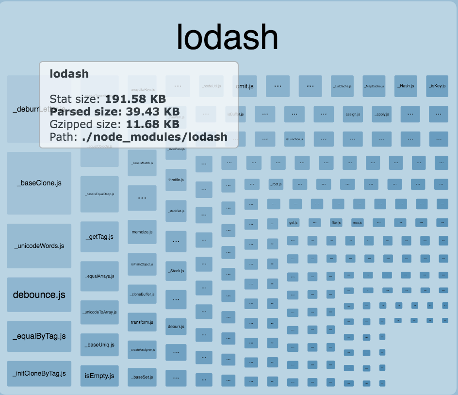
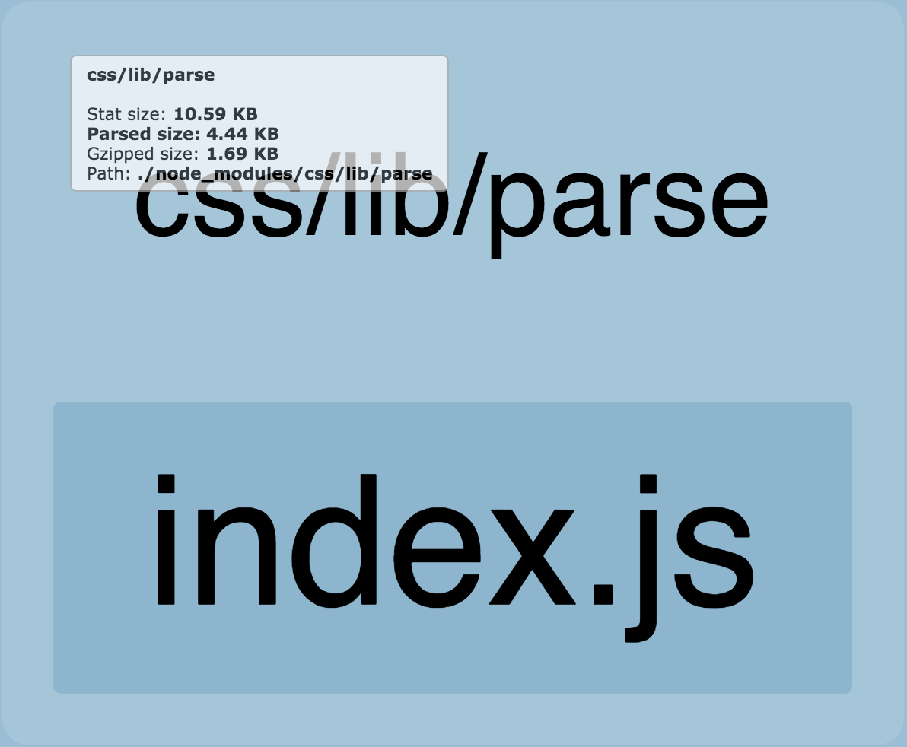
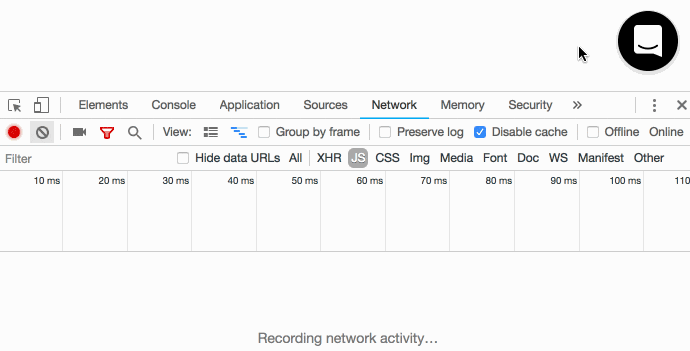

## Intercom Messenger is an app our customers embed on their website. Because of that, performance and bundle size has always been a top priority for us.

<Image width={80} caption="This is the entry point to our messenger which we call launcher">


</Image>

Last year we noticed the size of the bundle had been slowly growing, and by the end of the year, we were serving almost 600kb of gzipped javascript.

<Image width={600}>


</Image>

The first step was to install [webpack-bundle-analyzer](https://github.com/webpack-contrib/webpack-bundle-analyzer) to see what takes the most space in our bundle.


### Vendor bundle

Since node_modules takes around 40% of our bundle, and they don't change very often (we deploy to production multiple times a day, but rarely change the dependencies), we have decided to serve them from a separate bundle.

Webpack supports bundle splitting out of the box, and configuring it to split node_modules into separate bundle looks like this:

```js!webpack.config.js
module.exports = {
  optimization: {
    ...
    runtimeChunk: false,
    splitChunks: {
      cacheGroups: {
        vendor: {
          test: /[\\/]node_modules[\\/]/,
          priority: 1,
          enforce: true,
          chunks: chunk => chunk.name === 'frame',
          name: 'vendor',
        },
      },
    },
  },
  output: {
    ...
    chunkFilename: isProduction ? '[name].[chunkhash:8].js' : '[name].js',
  },
}
```

> We have multiple entries in our webpack config, but for a start, we have decided to work only with frame entry. `chunks: chunk => chunk.name === 'frame'` will make sure we split node_modules into vendor bundle only for the frame entry.

### Optimizing the node_modules

With the node_modules as a separate bundle, bundle analyzer prints:


### Underscore

Looking deeper into vendor bundle I noticed we are bundling the underscore library.

<Image width={300}>


</Image>

That seemed pretty weird to me, as we don't have underscore as our direct dependency.
Investigating further revealed it's getting pulled only because one of our dev dependencies needs it.

A quick search in codebase finds the offender:

```js
import { throttle } from 'underscore';
```

Since we already use lodash, we can import throttle from lodash. Eslint will ensure we don't accidentally import underscore any more:

```json!.eslintrc
"no-restricted-imports": [2, {
  "name": "underscore",
  "message": "Please use lodash instead."
}],
```

### Lodash

Bundle analyzer shows us we are bundling a whole lodash all the time.

<Image width={350}>


</Image>

With [babel-plugin-lodash](https://github.com/lodash/babel-plugin-lodash) we can cherry pick only modules we use from lodash, rather than bundling the whole library. It required us to do small refactor as [chain sequences aren’t supported](https://medium.com/making-internets/why-using-chain-is-a-mistake-9bc1f80d51ba).

The size of the lodash after using the babel plugin:

<Image width={350}>



</Image>

### Intercom-translations

Intercom-translations is our internal library that generates translations for all the supported locales.

<Image width={350}>


</Image>

The whole library is almost 60kb, but we can use just one translation at a time. This means 95% of that library is unused most of the time.

The logic for importing those translations looks like:

```js
let currentLocale = 'en';
export const defaultLocales = supportedLocales.reduce((locales, locale) => {
  locales[locale] = require(`intercom-js-translations/${locale}.json`);
  return locales;
}, {});

export const setLocale = locale => {
  currentLocale = locale;
};
```

We can use dynamic imports to bundle only English locale to the main bundle, and dynamically import any other only when it's needed.

To add support for dynamic imports, we need to add this two packages to our babel config:

```json!.babelrc
{
  "plugins": ["@babel/plugin-syntax-dynamic-import"],
  "env": {
    "test": {
      "plugins": ["dynamic-import-node"]
    }
  }
}
```

> @babel/plugin-syntax-dynamic-import will allow parsing of import(), and dynamic-import-node will transpile import() to a deferred require() in our tests.

```js
let currentLocale = 'en';
defaultLocales['en'] = require(`intercom-js-translations/en.json`);

export const setLocale = async locale => {
  if (!defaultLocales[locale]) {
    const data = await import(/* webpackChunkName: "locale-[request]" */
    `intercom-js-translations/${locale}.json`);
    defaultLocales[locale] = data;
  }
  currentLocale = locale;
};
```

This will add additional request to small 3kb file when using non-English locale but will reduce our initial bundle size by 55kb after gzip.

<Image width={350}>


</Image>

### Sentry client

Sentry is a library that we are using to collect errors in our app.

<Image width={350}>


</Image>

The truth is, most of our customers will not need this client to be bundled in, as errors are pretty rare.
Our simplified sentry integration looks like:

```js!errors.js
import * as Sentry from '@sentry/browser';
Sentry.init({
  dsn: config['sentry_dsn'],
  integrations: integrations => integrations.filter(
    integration => integration.name !== 'GlobalHandlers'
  ),
});

_export const logError = error => Sentry.captureException(error);
```

> Our setup already disables global handlers and only expose logError function that captures the errors manually.

Using the dynamic imports we can again import sentry client only when needed.

```js!sentry.js
import * as Sentry from '@sentry/browser';
Sentry.init({
  dsn: config['sentry_dsn'],
  integrations: integrations => integrations.filter(
    integration => integration.name !== 'GlobalHandlers'
  ),
});

_export const captureException = error => Sentry.captureException(error);
```

```js!errors.js
_export const logError = async error => {
  const {
   captureException,
  } = await import(/* webpackChunkName: "sentry" */ './sentry');
  captureException(error);
}
```

> If you are using redux-raven-middleware, you need to remove it, as it always includes sentry client. However, you can create your custom middleware to store actions and populate breadcrumbs on error.

### PSL

PSL package is a public suffix list.

<Image width={350}>


</Image>

Our messenger always tries to set cookies on the most generic domain. This means if you are on https://a.b.c.my-domain.com we will set cookies on .my-domain.com. However getting the TLD is a hard task due to many nonstandard like co.id. So at some point, we have decided to bite the bullet and add a list of all possible TLDs.

Solution to this was to move this logic to a server and remove psl package altogether.

### CSS

CSS is a library to parse and stringify css.

<Image width={350}>


</Image>

It exposes [two methods](https://github.com/reworkcss/css/blob/64910e8474385e4fde8cfe5369a9b768f3e08ac5/index.js): parse and stringify.
Looking into the codebase, I found out that we are using only parse API:

```js
import { parse } from 'css';
```

After changing our import to parse source:

```js
import parse from 'css/lib/parse';
```

pre gzip size suddenly drops from 122kb to 10kb:

<Image width={350}>



</Image>

### Application

After the vendor, we started to look into the application. A proposed solution was to split our application by routes. [Loadable component](https://github.com/jamiebuilds/react-loadable) makes this very straightforward.

Our simplified App component looks like:

```jsx!App.js
import React from 'react';
import Launcher from './launcher';
import Messenger from './messenger';

_export default class App extends React.Component {
  render() {
    return (
      <>
        <Launcher />
        {messengerIsOpen ? <Messenger /> : null}
      </>
    );
  }
}
```

Code splitting Messenger component using Loadable looks like this:

```jsx!App.js
import React from 'react';
import Loadable from 'react-loadable';
import Launcher from './launcher';

const Messenger = Loadable({
  loader: () => import(/* webpackChunkName: "messenger" */ './messenger'),
});

_export default class App extends React.Component {
  render() {
    return (
      <>
        <Launcher />
        {messengerIsOpen ? <Messenger /> : null}
      </>
    );
  }
}
```

There are various optimizations you can do. We have decided to pre-load messenger bundle once you hover over the launcher. This will remove most of the unwanted delays when waiting for additional bundles to load.



## Conclusion

We now serve multiple smaller bundles instead of one large bundle:


Various teams can now safely add new features to messenger without increasing the initial size of the messenger.

We have reduced our messenger size down to 280kb to boot the app.
That is 300kb reduction after gzip. 300kb can take up to 4 seconds on the fast 3G network and up to 14 seconds on slow 3G network. This is a massive improvement for mobile users.

Our biggest technical debt is the CSS that can't be split into smaller bundles, but we already have a plan to change that.

For relatively small effort we got significant gains in performance and bundle size. Smaller bundle means, less code to download, less code to execute, and less code to maintain.

Try to look into your bundle as well, you most likely adding duplicated code, or code that is rarely executed and can be loaded asynchronously.
